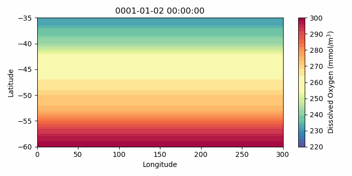

# MOM6_MARBL_eady_channel
This repository contains a Jupyter notebook (`MARBL_eady_channel.ipynb`) with instructions for:
1. Installing and compiling the MOM6 ocean model with the Marine Biogeochemistry Library (MARBL), either on NCAR's Cheyenne HPC system or locally on OSX
2. Creating initial conditions to run MOM6+MARBL in a zonally re-entrant channel using initial tracer distributions obtained as zonal averages from CESM output
3. Running the channel configuration (using code found in `eady_channel_code`)

The instructions are shown as Markdown cells in the notebook

---

## Example output:

---

---
## Acknowledgements: 
Mike Levy (MOM6 source code and compilation instructions), Scott Bachman (channel config), Elizabeth Yankovsky (MARBL initialisation code)
